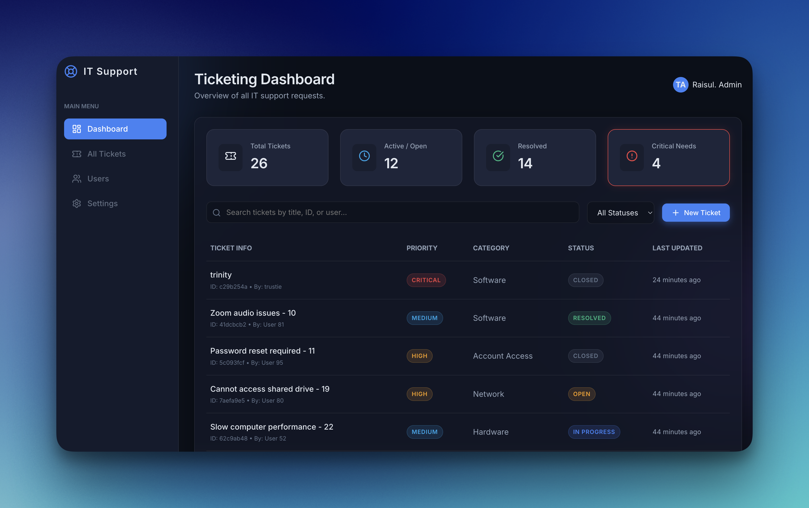
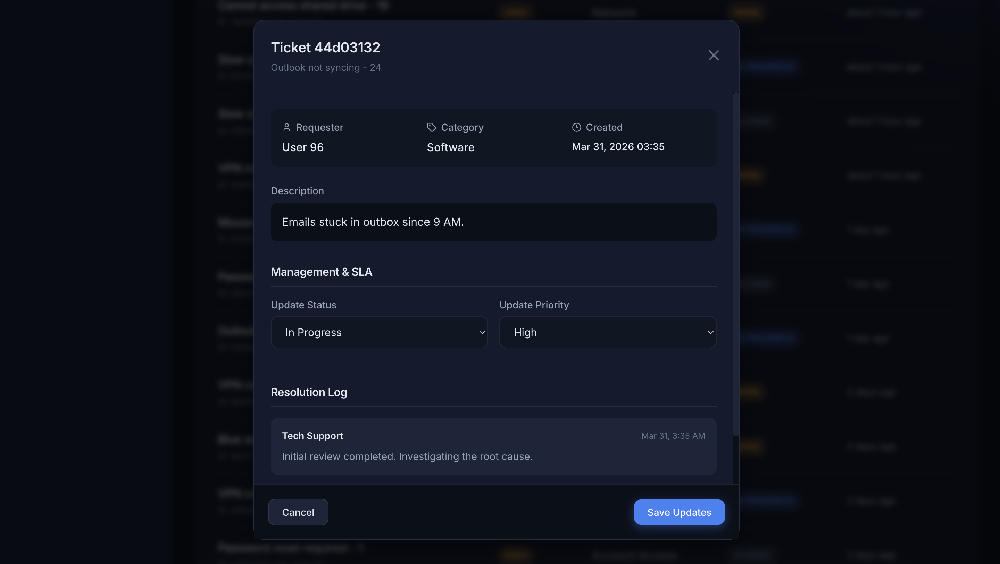
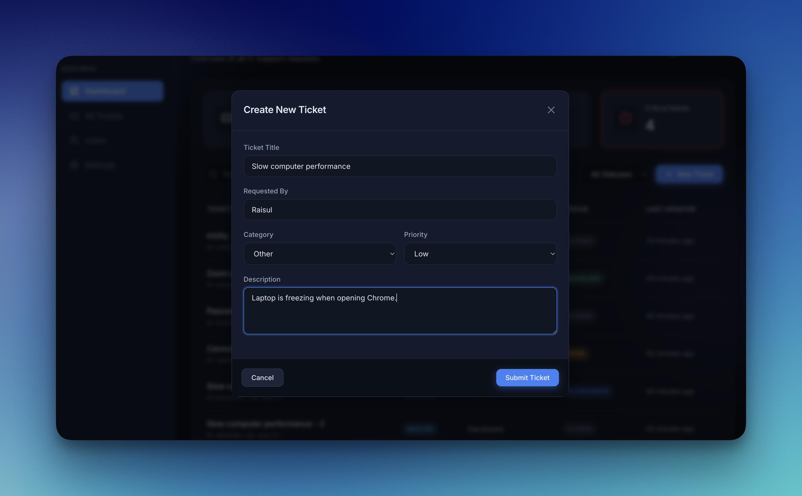

# 🔧 IT Help Desk Ticketing System Simulation



*A production-quality Help Desk Operations simulation designed for IT Support Portfolio demonstration.*

## 📋 Project Overview
This project is a realistic simulation of a corporate IT Help Desk Ticketing System, demonstrating the core workflow and issue-resolution life-cycles handled by User Support Technicians and System Administrators. 

Built with scalability, accessibility, and modern UI/UX principles in mind, the application features an extensive SLA-aware ticket dashboard, real-time logging, and metric tracking to highlight IT Support processes from ticket creation to issue resolution.

---

## ✨ Core Features
*   **Complete Ticket Lifecycle**: Tracks tickets through `Open` → `In Progress` → `Resolved` → `Closed`.
*   **SLA & Priority Management**: Enforces priority levels (`Low`, `Medium`, `High`, `Critical`), utilizing visual color-coding to highlight urgent needs.
*   **Resolution Logging System**: Support technicians can document internal troubleshooting notes and end-user communication directly into the ticket resolution logs.
<br>



*   **Dynamic Dashboard Environment**: An interactive, glassmorphism-styled dashboard containing quick-metric cards (Open, Urgent, Resolved) and real-time filtering mechanisms.
<br>

*   **Preloaded Scenario Database**: Shipped with a seeded lightweight JSON database simulating 25 realistic corporate IT problems (VPN disconnects, Active Directory lockouts, BSOD instances).

---

## 💻 Tools & Technologies Used
*   **Frontend**: React (Vite), React Router, Lucide Icons, Date-FNS.
*   **Styling**: Custom CSS Modules adhering to a sophisticated dark-mode aesthetic (CSS Variables, Glassmorphism).
*   **Backend / API**: Node.js, Express.js.
*   **Storage Architecture**: File-based JSON Database Engine (`fs` module manipulation), keeping the project footprint lightweight, predictable, and rapidly deployable.

---

## 🛠️ Simulation of Real-World IT Environments
This project mirrors enterprise environments typically powered by ServiceNow or Jira Service Desk by implementing:
1.  **Severity Parsing**: Distinguishing a localized hardware failure (Medium) from an enterprise-wide VPN outage (Critical).
2.  **Audit Trials**: The resolution log accurately timestamps each action and associates it with the responsible technician.
3.  **Metrics-Driven Operations**: Visualizing active pipelines prevents SLA breaches and enables technicians to identify high-priority clusters instantly.

### Sample Ticket & Resolution Flow
> **Ticket**: "VPN connection dropping" (Category: Network) — **Priority: Critical** 🔴
> *   *Status Updates*: Open -> In Progress
> *   *Resolution Note 1*: "System Admin identified an expired SSL certificate on the primary firewall. Rerouting traffic to secondary gateway."
> *   *Resolution Note 2*: "VPN tunnel stabilized. Contacted user to verify connectivity. Marking as Resolved."

---

## 🚀 Getting Started (Run Locally)

The application utilizes a `concurrently` script allowing both sides of the full-stack app to launch side-by-side using a single command. 

### Prerequisites
*   Node.js (v18+)
*   NPM or Yarn

### Installation Steps
1. Clone this repository
2. Install dependencies for the orchestrator, backend, and frontend:
```bash
npm install
cd frontend && npm install
cd ../server && npm install
```
3. Initialize the database with 25 realistic pre-seeded tickets (Optional but recommended):
```bash
npm run seed
```
4. Start the Application:
```bash
npm start
```
*The Frontend will launch at `localhost:5173` and the Backend API will answer at `localhost:3001`.*

---

## 🔮 Future Improvements 
*   **Authentication & Role-Based Access (RBAC)**: Distinguishing End-User views vs. Technician/Administrator views using JWT Tokens.
*   **Email Integation**: Sending simulated receipt emails on ticket creation/resolution via Nodemailer.
*   **Advanced Analytics**: Utilizing Chart.js for visualization of typical issue categories to identify recurring training opportunities.
*   **Database Scaling**: Migrating the JSON store to a fully relational SQLite or PostgreSQL database via Prisma ORM for complex queries.

---
